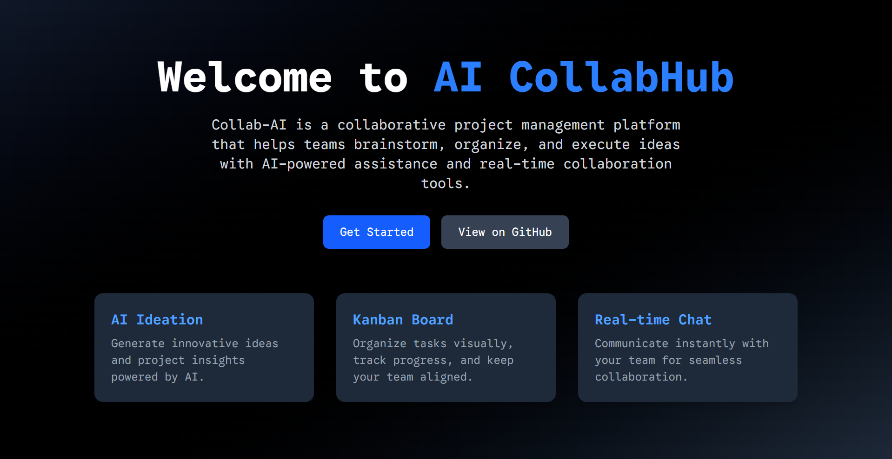
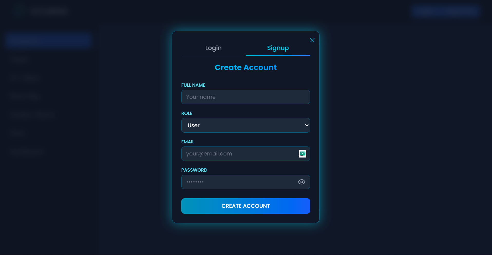
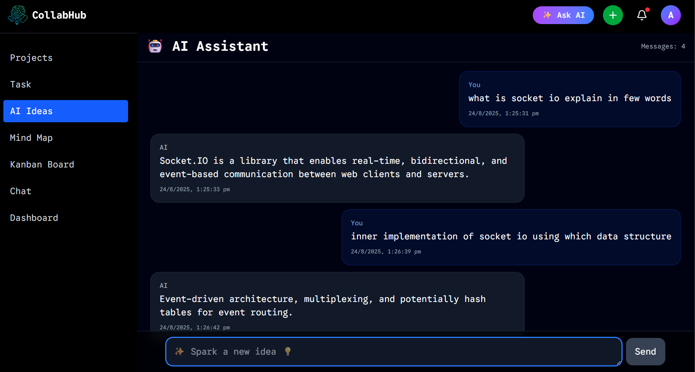
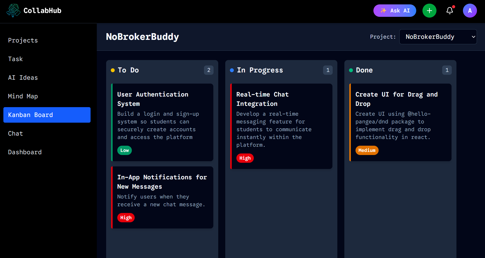
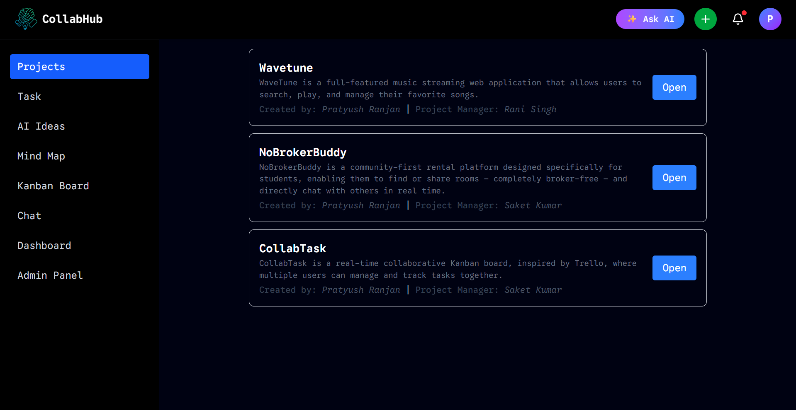
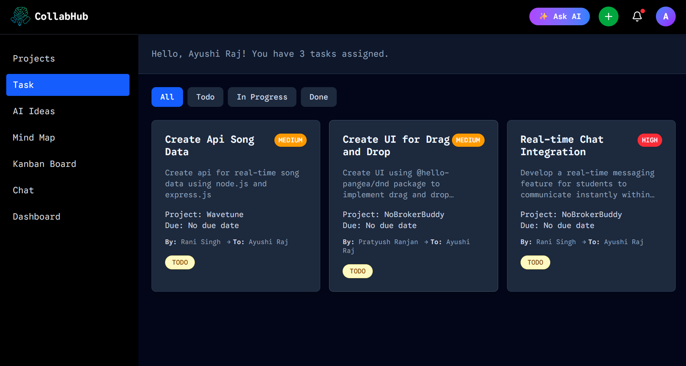
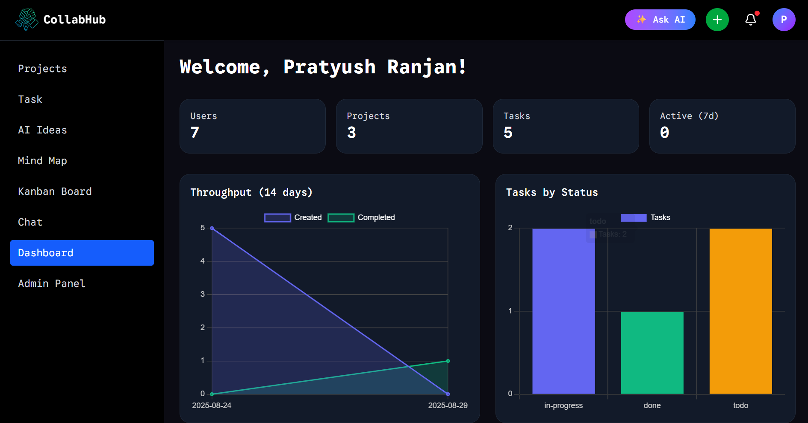

# 🚀 Collaborative AI-Powered Project Platform  

Hey there! 👋  
This is my official GitHub repository for the **Collaborative AI-Powered Project Management Platform (CollabHub)** — a full-stack web app designed to combine the best of **Trello + Notion + Slack + Miro** into one seamless solution for team collaboration and productivity.  

💡 This project was developed as part of my **Full Stack Development Internship at Infotact Solutions**, where I worked on integrating **real-time collaboration, AI-powered ideation, and scalable project management features** into a single platform.  

🔗 **Repository Link:** [collab-ai-project-platform](https://github.com/pratyushranjn/collab-ai-project-platform)  

---

## 📁 Folder Structure  

The project is organized into two main parts:  

- `frontend/` – built with **React**, **Tailwind CSS**, and **Vite**  
- `backend/` – built with **Node.js** and **MongoDB**  

---

## 🔑 Key Features  

- 🔐 **User Authentication & Role-Based Access Control (RBAC)** – Admin, Manager, Member  
- 🤖 **AI Assistant** – for idea generation & brainstorming  
- 📋 **Kanban-style Task Management** – with drag & drop  
- 🖊 **Real-time Whiteboard** – shapes, lines, mind maps, and board clearing  
- 💬 **Project-based Group Chat & Threaded Discussions** – real-time messaging with instant notifications (Socket.IO)  
- 🗂 **Project & Task APIs** – CRUD operations with MongoDB + Express  
- 📊 **Analytics Dashboard** – insights for projects & tasks  
- ⚙️ **Admin Panel** – manage projects, users, and roles  

---

## 🛠️ Tech Stack  

- **Frontend:** React, Vite, Tailwind CSS  
- **Backend:** Node.js, Express, MongoDB  
- **Real-time:** Socket.IO  
- **Auth:** JWT (JSON Web Tokens)  
- **AI Integration:** Gemini API  

---

## 🖼️ UI Previews

### 🏠 Landing Page

### 🔐 Auth UI

### 🤖 AI Ideas

### 🧩 Kanban Board 

### 📁 Projects

### ✅ Tasks

### 📊 Dashboard

---

## 🚧 Work in Progress

More features and improvements are coming soon.  
Feel free to star ⭐ the repo!

---
