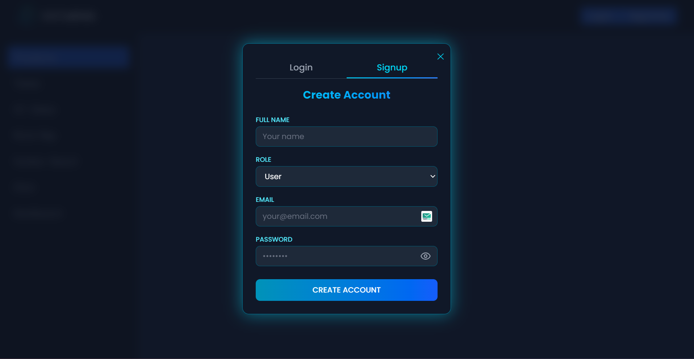
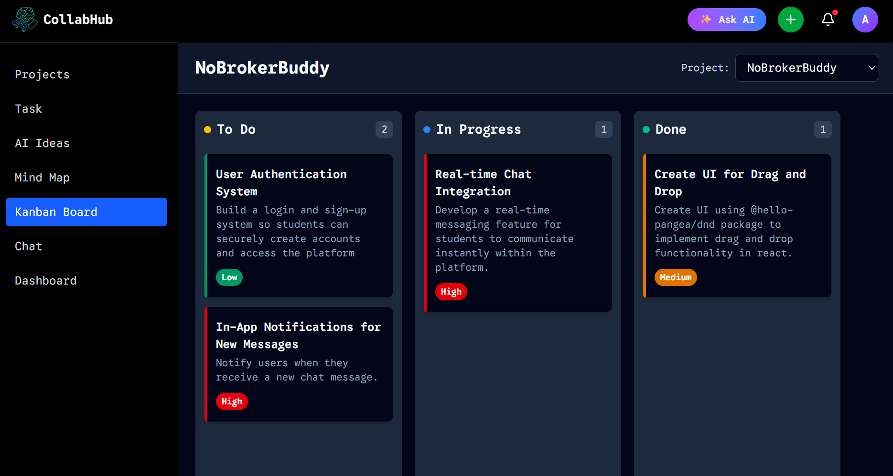

# 🚀 Collaborative AI-Powered Project Platform  
**By [Pratyush Ranjan](https://github.com/pratyushranjn)**

Hey there! 👋  
This is my official GitHub repository for the **Collaborative AI-Powered Project Platform** — a full-stack web app built to streamline project collaboration with the help of AI.

🔗 **Repository Link:** https://github.com/pratyushranjn/collab-ai-project-platform

---

## 📁 Folder Structure

The project is organized into two main parts:

- `frontend/` – built with **React**, **Tailwind CSS**, and **Vite**
- `backend/` – built with **Node.js** and **MongoDB**

---

## 🖼️ UI Previews

### 🏠 Landing Page

### 🔐 Auth UI

### 🤖 AI Ideas

### 🧩 Kanban Board 

### 📁 Projects

### ✅ Tasks

---

## 🚧 Work in Progress

More features and improvements are coming soon.  
Feel free to star ⭐ the repo or contribute!

---
